# css_vault_lab/README.md

Lab organizers, see [labadmin.md](./labadmin.md) for instructions about setting up this lab
 
# Lab overview 

This lab is designed to very quickly demonstrate several of the features of [Hashicorp Vault](http://www.vaultproject.io)
including simple secrets engine (key/value pairs), dynamic database secrets, ssh one-time passwords and maybe
more in the future (i.e. github authentication and Transit encryption as a service)

## Resources
Each lab user will have a dedicated hashicorp [vault](http://vaultproject.io) server with a 
[consul](http://consul.io) storage backend. Each lab user will also have a dedicated linux web server
running a simple [flask](http://flask.pocoo.org) application which uses a mysql database on the same server.
All of this infrastructure is hosted in AWS and uses Hashicorp's open source products.

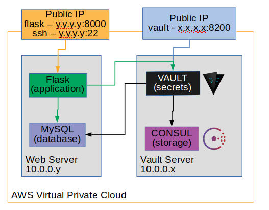

Your lab facilitator will provide you with the IP addresses for this lab in a format similar to:

    Lab User 2:
      Vault Public IP: 18.222.20.111 (http://18.222.20.111:8200)
       Web Private IP: 10.0.0.168
        Web Public IP: 18.219.24.215 (http://18.219.24.215:8000)
         Web ssh user: labuser `ssh labuser@18.219.24.215`
      Web Profile ARN: arn:aws:iam::603006933259:instance-profile/vaultlab-dev-web-profile
 
# Lab Instructions   

### Lesson 1. Unseal vault 

Your lab vault server has been installed, but the secure vault has not yet been initialized. The first step
is to unseal the vault

 1. Unseal the vault
    * Point browser to http://x.x.x.x:8200 where x.x.x.x is the public IP of the vault server
    * Initialize vault with 5 keys and 3 key threshhold required to unseal
        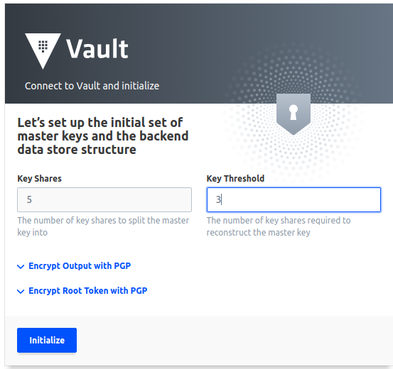
        
    * Initialization complete
    
        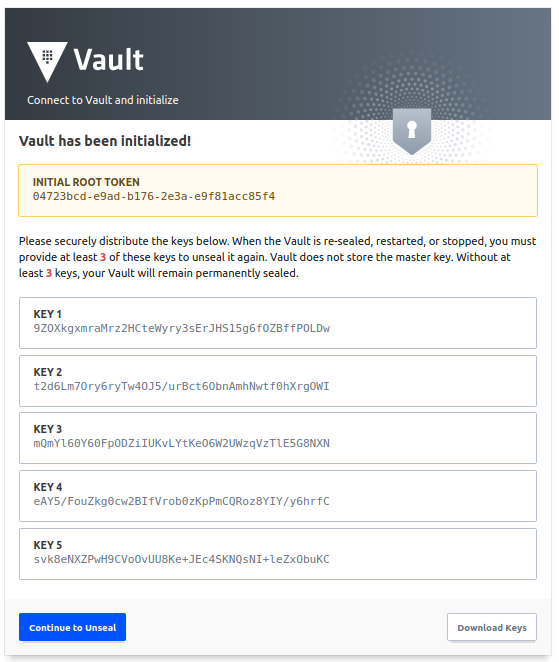
        
    * Download keys to your local PC
    
        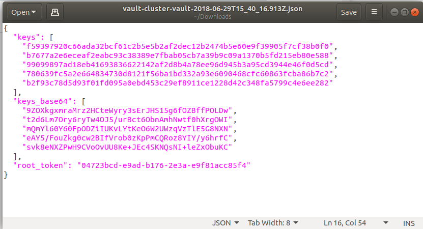
        
    * Unseal vault using 3 of 5 "keys"
    
        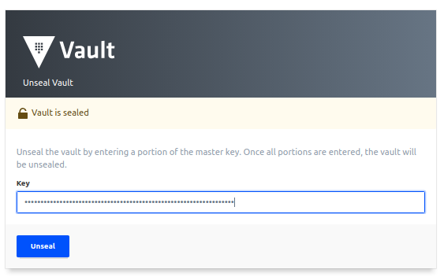
        
    * Login to vault with root_token
    
        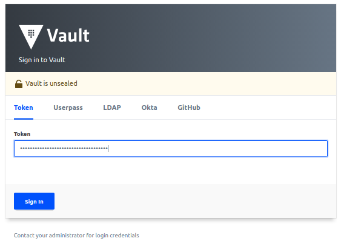
    
## Lesson 2. Generic Secrets

After the vault is unsealed, lets practice storing some basic kay/value pairs in the vault 
standard "secrets" backend, which is enabled by default. Much of vault is configured via
CLI and the web UI gives us a handy console with which to configure vault.

The secrets we enter here will be used by our web server to determine information about 
the database server. The secrets here arent particularly sensitive, but it is handy to 
store this configuration information in a centralized and secure location so that maintaining 
it is much easier and safer than storing in config files on the server.
    
 1. Use the generic secrets backend to store information about the database
    * Open Vault Web CLI by clicking the ">_" button in top right of vault UI
        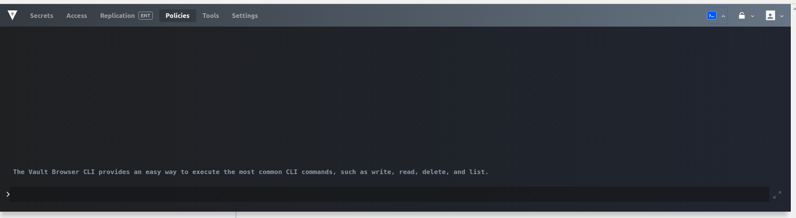
        
    * Enter the following vault command to store 3 key/value secrets in path secret/mysql
      ```
      vault write secret/mysql host="127.0.0.1" port="3306" database="vaultlabdb"
      ```
        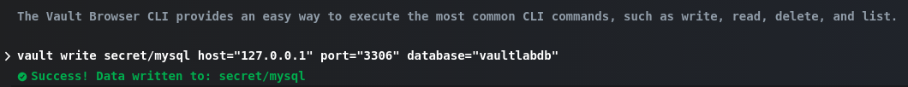
    
    * check that we can read the secret stored in secret/mysql
      ```
      vault read secret/mysql
      ```
        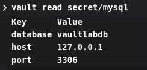
        
Congratulations, you have just stored your first secrets in this vualt!
    
## Lesson 3. Dynamic database secrets        

Our web server is going to need to access the database server. To do so requires that the web
server have some credentials (username & password) to access the database. Typically this information
would be set by a DBA, emailed to the web admin who stores the passwords on the web server in a configuration
file. This is insecure for several reasons
1. It is very hard to rotate passwords when they are stored in static configu files
2. The database credentials are passed around, version controlled and even backed up in an insecure fashion
2. If the web server is compromised, so is the database and all of its data
3. Since the passwords are not easily rotated (see #1 above) and all web servers often use the same
   username and password. In an incident response situation, is not easy to isolate which web server has
   been compromised and disable its credentials without taking the entire application offline.
   
Vault provides us with a powerful ability to issue short lived, single use database passwords to
application servers, so that each app server has a unique password which is randomly generated
and has a short life (30 minutes in this example). This is much easier to manage and much more secure.

In this lab, the MySQL database server is located on the same host as the web server for simplicity.
In the real world, the database would probably live on a separate server. The functionality is the same however. 

Note: The mysql database has already been initialized as part of this lab where a vault administrative
user:vaultadmin with password:vaultadminpassword has been created using the following SQL statement:
`GRANT ALL PRIVILEGES ON *.* TO 'vaultadmin'@'%' IDENTIFIED BY 'vaultadminpassword' WITH GRANT OPTION;`

First, we must enable a new secrets backend. 

 1. Enable database secrets backend in the Vault Web UI
 
    * Secrets > Enable new engine > Database > Enable Engine
 
 2. Configure vault's connection to the mysql server and allow the role called "readwrite" to access it.
    (we'll configure the role "readwrite" in the next step)
    * Open Vault Web CLI by clicking the ">_" button in top right of vault UI
    * Enter the following vault command:
        ```
        vault write database/config/mysql \
            plugin_name=mysql-legacy-database-plugin \
            allowed_roles="readwrite"
            connection_url="vaultadmin:vaultadminpassword@tcp(10.0.0.x:3306)/"
        ```
        where **10.0.0.x** is the private IP address of the web server that hosts the MySQL database. 
    
 3. Configure a vault role named "readwrite" that can create a user on in database with a 30 minute TTL
    * Enter the following vault command:
        ```
        vault write database/roles/readwrite \
            db_name=mysql \
            creation_statements="CREATE USER '{{name}}'@'localhost' IDENTIFIED BY '{{password}}';GRANT ALL ON vaultlabdb.* TO '{{name}}'@'localhost';" \
            default_ttl="30m" \
            max_ttl="24h"
        ```
    
 4. Test that you can read dynamic database credentials as the root user
    * Enter the following vault command:
        ```
        vault read database/creds/readwrite
        ````    
    * example:
    
        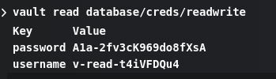
      
        the username: is the dynamic username create and password is the password

## Lesson 4. AWS EC2 authentication method

Now we want to allow our web application to access vault and retrieve the simple secrets that 
we configured in Lesson2 and the dynamic database credentials we configured in Lesson4. 

We need a secure way for the web application to authenticate with vault. It would defeat the 
purpose of dynamic passwords if we were to store a vault username/password on the web server.
Because our web instance
is an AWS EC2 virtual machine, we can use the Vault AWS authentication method that will validate
that the requester is a legitimate AWS EC2 instance and we will also confirm that a specific 
AWS instance profile has been attached to the instance. This should ensure that a rouge EC2 instance
cannot access vault, and that we can grant/remove access to the database by simply adding/removing IAM
roles in AWS. 

1. Create a policy for the web server that can access the secrety/mysql path and the dynamic db secrets
    * Open Vault Web CLI by clicking the ">_" button in top right of vault UI
    * Policies > Create ACL Policy
        * Name: web-policy
        * Policy: 
            ```
            path "sys/*" {
               policy = "deny"
            }
            path "secret/mysql*" {
               capabilities = ["read"]
            }
            path "database/creds/readwrite" {
               capabilities = ["read"]
            }
            ``` 
2. Enable AWS authentication method
    * Access > Auth Methods > Enable new method > Select Type: AWS > Enable Method
        
    * Open Vault Web CLI by clicking the ">_" button in top right of vault UI
    * Enter the following vault command:
        ```
        vault write auth/aws/role/web-role \
            auth_type=ec2 \
            policies=web-policy \
            disallow_reauthentication=false \
            bound_iam_instance_profile_arn=arn:aws:iam::603006933259:instance-profile/vaultlab-dev-web-profile
        ```
        Where *bound_iam_instance_profile_arn* is the amazon resource name of the IAM instance
        profile that require be attached to the web instance to authenticate with vault.
 
3. Check the web application
    * open browser to http://z.z.z.z:8000 
       
       where z.z.z.z is public IP address of web server

    * go to the Vault Credentials tab. 
        
        Notice that the web app didn't authenticate with vault and cant get db credentials.
        When this web application starts up, it tries logging into vault. At that time, vault
        was sealed and the login failed. Additionally, vault is configured to not allow subsequent 
        logins for security so that other instances cant masquerade themselves as our instance.
        This works really well for ephemeral web applications that have a short life. 
        
        In the real world, to resolve this, we'd probably just terminate the web server and 
        redeploy a new one. But for this lab, we'll demonstrate that we can delete reference
        to the instance in vault and then restart the web application. 
      
4. Delete the one time authentication token, so that our web server can try authenticating again.
    * query the white listed AWS identities 
      ```
      vault list auth/aws/identity-whitelist
      ```
      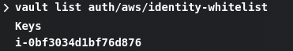
    * delete the instance id that we'd like to give another chance
      ```
      vault delete auth/aws/identity-whitelist/i-xxxx
      ```
      Where i-xxxx is the AWS instance ID of the server who's identity we want to forget
      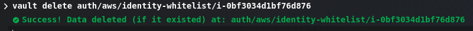
      
## Lesson 5. ssh one time passwords

This web application is written to log into vault and store authentication tokens in memory,
not on disk. The web application is designed to be one-time-use and only tries logging into
vault when it is first started. In a real world application, if this happened to an application
server, we'd probably just terminate it and deploy a new one. But in this lab, we want to restart
the web application (and demo one time use ssh passwords).

Ssh keys or passwords present a real challenge for administrators trying to maintain a highly
secure environment across multiple admin team members. Often, admins use a single ssh key, stored
in an insecure location (laptop hard drive) that can access many or all of the companies cloud
servers. This is scary, because if the key ever falls into the wrong hands, it is almost impossible
to clean that key from a farm of servers. 

Vault gives us the ability to issue administrators one time use passwords so that they can
ssh into a server and make a change. We can then centrally manage vault users (or processes)
permissions to access the farm of servers with secure, one time use passwords!

We'll use the ssh one time password feature to login to the web server and restart the service.

Note: Our linux web server has been already configured with the
[vault-ssh-helper](https://github.com/hashicorp/vault-ssh-helper) utility to
to allow remote users to access the server with one time passwords generated by our vault server. 

 1. Enable ssh secrets backend in vault UI
    * Secrets > Enable new engine > SSH > Enable Engine
    
 2. Create a role with the key_type parameter set to otp (one time password)
    * Open Vault Web CLI by clicking the ">_" button in top right of vault UI
    * Enter the following vault command:
        ```
        vault write ssh/roles/otp_key_role \
            key_type=otp \
            default_user=labuser \
            cidr_list=10.0.0.0/16
        ```
        Where **labuser** is the name of the linux user for which we will enable ssh access
        and **10.0.0.0/16** is the network(s) for which we will allows vault client connections for ssh
    
 3. Generate a One Time Password for the web host to which we want to connect
    * Open Vault Web CLI by clicking the ">_" button in top right of vault UI
    * Enter the following vault command:
        ```
        vault write ssh/creds/otp_key_role \
            ip=10.0.0.x
        ```
        where **10.0.0.x** is the private IP address of the web server that we want to access.
        
        example:
        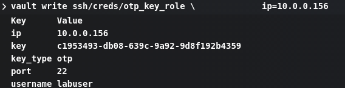
        
        The "username" is the username that we'll use and "key" is a one time password for logging in
    
 4. Ssh into the web server host using the one time password
    * Open a ssh client and when prompted, enter the key from above as the one time password
        ```
        ssh labuser@y.y.y.y
        ```
        where y.y.y.y is the public IP of the web server.
        
        If you dont have an ssh client
        * for windows, try [putty](http://www.putty.org)
        * Or try this client that runs in your web browser [sshgate](https://www.redcoolmedia.net/sshgate/)
        

 5. Restart the web service
    
    ```
    sudo service flask restart
    ```
    
    example:
    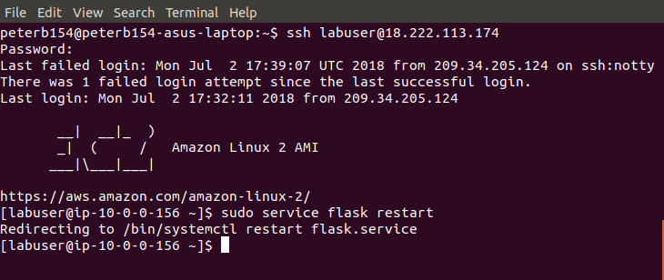
    
 6. Now check the web application again.
 
    * refresh the browser window for the web application. Everything should be working!
    
